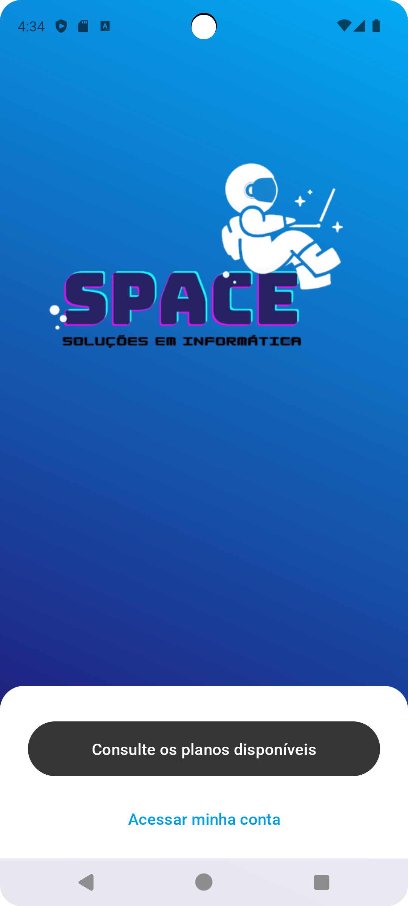
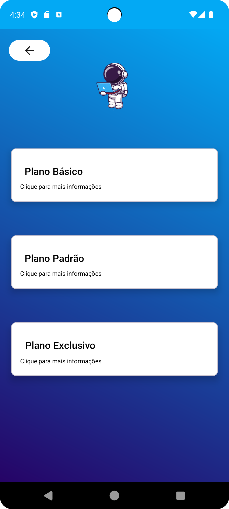
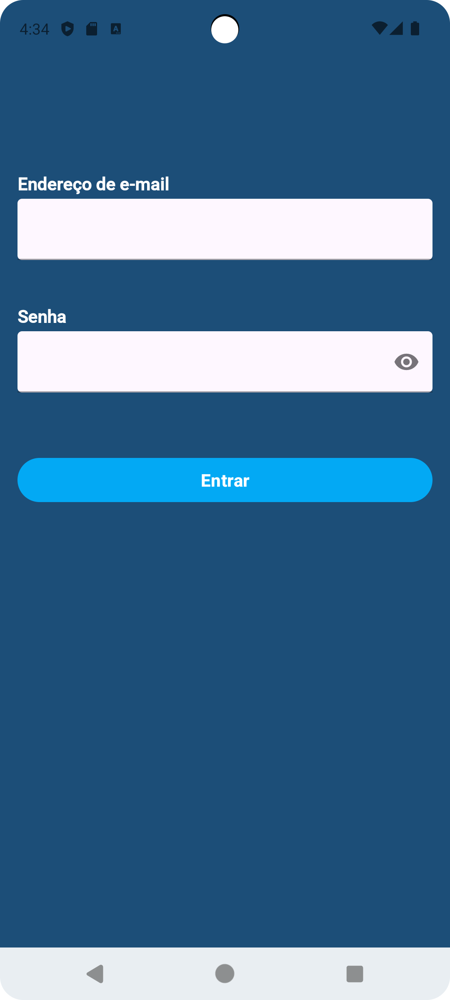
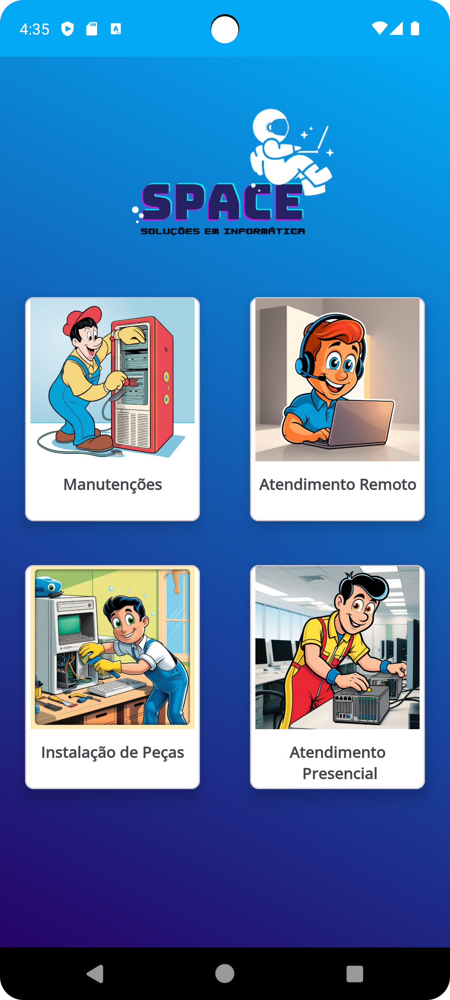

# 💼 Aplicativo de Gestão de Planos de Manutenção - 

Este é um aplicativo Android nativo desenvolvido para um comércio local especializado em manutenção de computadores. O projeto foi criado sob demanda para atender às necessidades de um amigo empreendedor, que desejava oferecer uma ferramenta prática e eficiente aos seus clientes.

#

# 🎯 Objetivo

O aplicativo tem como principal função permitir que os clientes acompanhem e gerenciem seus planos de manutenção de computadores contratados com a loja. Ele proporciona transparência e controle, facilitando o acesso a informações como:

* Tipo de plano contratado

* Duração e validade do plano

* Histórico de manutenções realizadas

* Alertas sobre vencimentos ou próximos atendimentos

#

# 👨‍💼 Cliente

Este projeto foi desenvolvido sob medida para um técnico de informática da cidade, visando oferecer mais profissionalismo, fidelização de clientes e melhor gestão dos serviços prestados.

  
  
  
  

